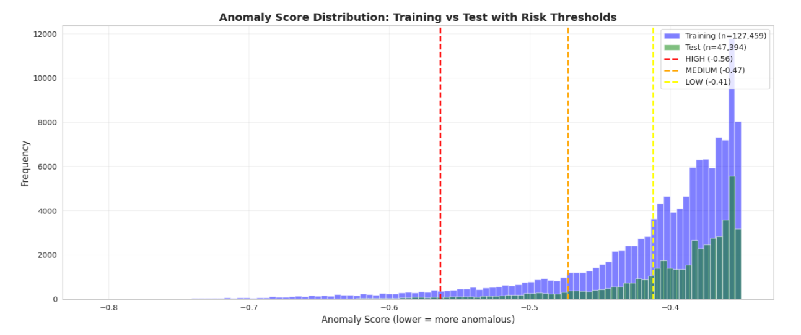

# Isolation Forest Algorithm for Fraud Detection in Philippine Public Procurement



Personal project on anomaly detection and audit prioritization for Philippine public procurement data.

## Repository Status

This repository is prepared for GitHub upload.

Maintenance status: archived (no further active development planned).

- Source code and notebooks are included.
- Raw, processed, and backup datasets are intentionally excluded from version control.
- Generated results are also excluded.

## Dataset Access

The dataset used in this project must be downloaded manually from the PhilGEPS website.

- **Source:** Philippine Government Electronic Procurement System (PhilGEPS)
- **Open Data Portal:** https://philgeps.gov.ph/CmsHomePages/open-data
- **Data type:** Public procurement notices and award records exported as CSV
- **Required version for this repo:** **PhilGEPS 1.5 (old)** data format (for notebook/file compatibility)

After downloading, place the files in [data/raw](data/raw).

Tracked dataset files are intentionally not included in this repository.

Expected raw files for the current notebook workflow:

- `2021_Jan-Mar.csv`
- `2021_Aprl-Jun.csv`
- `2021_Jul-Sep.csv`
- `2021_Oct-Dec.csv`

The repository does not ship these files because of size and data distribution concerns.

Compatibility note: use PhilGEPS 1.5 (old) exports to match the expected columns and structure used by notebooks [notebooks/01_exploratory_data_analysis.ipynb](notebooks/01_exploratory_data_analysis.ipynb), [notebooks/02_data_preprocessing.ipynb](notebooks/02_data_preprocessing.ipynb), and [notebooks/03_isolation_forest.ipynb](notebooks/03_isolation_forest.ipynb).

## Quick Start

### 1. Create and activate a virtual environment

Linux/macOS:

```bash
python3 -m venv .venv
source .venv/bin/activate
```

Windows PowerShell:

```powershell
python -m venv .venv
.venv\Scripts\Activate.ps1
```

### 2. Install dependencies

```bash
pip install pip-tools
pip-sync requirements.txt
```

### 3. Run the notebooks in order

1. [notebooks/01_exploratory_data_analysis.ipynb](notebooks/01_exploratory_data_analysis.ipynb)
2. [notebooks/02_data_preprocessing.ipynb](notebooks/02_data_preprocessing.ipynb)
3. [notebooks/03_isolation_forest.ipynb](notebooks/03_isolation_forest.ipynb)

## Notebook Workflow

### Notebook 1: Exploratory Data Analysis

Explores the raw PhilGEPS exports and performs initial data checks.

### Notebook 2: Data Preprocessing

Creates processed datasets for model development.

- Set `MODE = 'TRAIN'` to generate `procurement_train.csv`
- Set `MODE = 'TEST'` to generate `procurement_test.csv`

### Notebook 3: Isolation Forest Baseline

- Trains on the training dataset
- Applies the trained model to the test dataset
- Produces ranked anomaly outputs and audit priority files

## Project Structure

```text
procurement/
├── data/
│   ├── raw/            # Downloaded PhilGEPS CSV files (not tracked)
│   ├── processed/      # Generated processed datasets (not tracked)
│   └── features/       # Optional derived data artifacts (not tracked)
├── notebooks/          # Main thesis notebooks
├── results/            # Generated outputs and figures (not tracked)
├── src/                # Python modules and helpers
├── README.md
├── PROJECT_PLAN.md
├── requirements.in
└── requirements.txt
```

## Notes

- The current baseline workflow uses a train/test split based on 2021 procurement quarters.
- Notebook outputs may differ depending on the exact PhilGEPS exports downloaded.
- If raw filenames differ, update the file paths in notebook 1 and notebook 2.

## Documentation

- [.github/copilot-instructions.md](.github/copilot-instructions.md)
